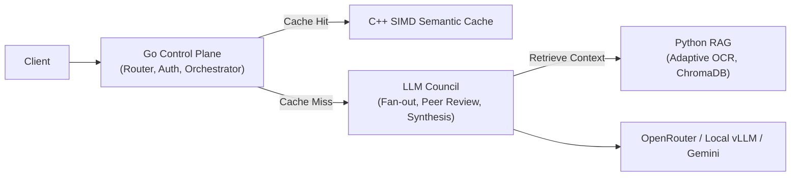

# CouncilAI


**CouncilAI** is a highly agentic document deliberation and Q&A engine built around a multi-agent LLM council. 

Upload a PDF, ask questions, and get answers that are independently generated, peer-reviewed, and synthesized across an ensemble of collaborative language models.

---

### 🚀 TL;DR
Instead of trusting a single LLM, CouncilAI deploys a multi-agent pipeline:
1. **Router Agent**: Classifies query intent and routes to L1 Cache, Direct Mode, or Full Council.
2. **Council Member Agents**: Multi-model agents generate candidate answers in parallel.
3. **Peer-Review Loop**: Agents cross-evaluate and rank each other's responses.
4. **Chairman Agent**: Moderates and synthesizes the final consensus.
5. **Self-Reflection Agent**: Audits the synthesized answer and triggers a revision loop if needed.

## 🧠 Key Features

* **Higher Accuracy**: Multi-model consensus outperforms single-model inference.
* **Confidence Scoring**: Every answer carries a numeric confidence rating and reasoning trace.
* **Cost Optimization**: C++ SIMD Semantic Caching prevents redundant LLM calls (240x speedup).
* **100% Offline Capability**: Plug-and-play support for local vLLM models for zero-fee, private execution.
* **Web-Search Grounding**: Fallback real-time search context when no document is provided.

## 🏗️ Architecture


*For deep technical diagrams and data flows, read the [System Design Document](docs/architecture/system-design.md).*

## ⚡ Quick Start

```bash
git clone https://github.com/regular-life/CouncilAI
cd CouncilAI
./setup.sh
docker compose up --build
```
*   **UI**: Open `http://localhost:8501` (Login: `demo` / `demo123`)
*   **API**: Backend listening at `http://localhost:8080`

For exhaustive setup instructions, including running local offline models, see the [Getting Started Guide](docs/guides/getting-started.md).

## 📚 Documentation Directory

Deep dive into the architecture and operations using our documentation suite:

*   **[Getting Started Guide](docs/guides/getting-started.md)**: Full setup instructions.
*   **[REST API Reference](docs/api/rest-api.md)**: Endpoints, authentication, and payloads.
*   **[System Design Doc](docs/architecture/system-design.md)**: Google-style design doc covering the deliberation patterns.
*   **[Technical Details](docs/architecture/technical-details.md)**: Deep dive into the C++ SIMD, RAG OCR, and concurrency patterns.
*   **[SDLC & Testing](docs/guides/sdlc-and-testing.md)**: How to run the caching benchmarks and concurrency stress tests.
*   **[Changelog](docs/CHANGELOG.md)**: Version history.

## 🤝 Contributing

This is a personal project, but feedback, issues, and pull requests are always welcome! Feel free to open an issue if you spot a bug or have a feature idea.

---
*CouncilAI was originally built under the legacy name "PadhAI Dost" ("Study Friend" in Hindi).*
