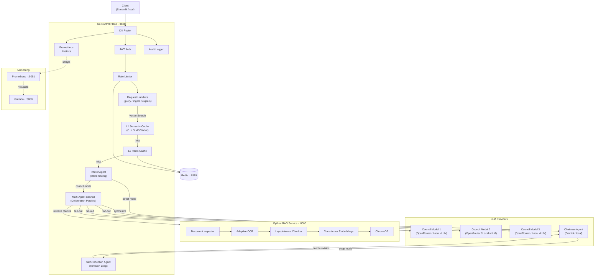
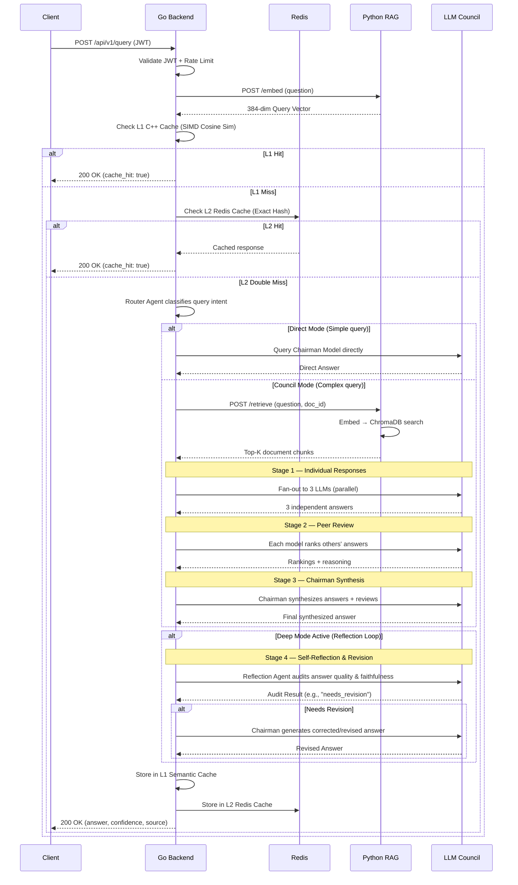

# CouncilAI: Multi-Agent Deliberation & Self-Reflective Document Engine

CouncilAI is a highly agentic document deliberation and Q&A engine built around a multi-agent LLM council. Upload a PDF, ask questions, and get answers that are independently generated, peer-reviewed, and synthesized across an ensemble of collaborative language models.

The council pattern is inspired by [Karpathy's LLM Council](https://github.com/karpathy/llm-council) — instead of trusting a single model, CouncilAI deploys a multi-agent pipeline:
1. **Router Agent**: Dynamically classifies query intent and routes to the most efficient mode (L1 Cache, Direct Mode, or Full Council).
2. **Council Member Agents**: Multi-model agents that generate candidate answers in parallel.
3. **Peer-Review Loop**: Agents cross-evaluate and rank each other's responses.
4. **Chairman Agent**: Moderates and synthesizes the candidate answers and peer reviews.
5. **Self-Reflection & Revision Loop**: In deep mode, a reflection agent audits the synthesized answer for quality and faithfulness, dynamically triggering a correction and revision pass if issues are detected.

Originally built as a study tool under the legacy name "PadhAI Dost" ("Study Friend" in Hindi), the architecture is general-purpose and works for any complex, document-grounded knowledge task.

---

## Architecture



### Request Lifecycle



---

## Getting Started

### Prerequisites

* **Docker and Docker Compose** (Required)
* **LLM Access Option A: Online APIs** (Optional): An [OpenRouter](https://openrouter.ai/) and/or [Gemini](https://aistudio.google.com/apikey) API key.
* **LLM Access Option B: Local Models** (Optional): A GPU-enabled system to run local vLLM models (making the stack **100% offline and free of API fees**).

### 1. Clone and Configure

```bash
git clone https://github.com/regular-life/CouncilAI
cd CouncilAI
./setup.sh
```

The interactive `./setup.sh` script automatically:
* Copies `.env.example` to `.env` (preserving any existing keys).
* Generates a high-entropy cryptographically secure random `JWT_SECRET`.
* Prompts you to optionally input your Gemini, OpenRouter, and NVIDIA NIM keys.

*(Alternatively, you can manually copy `.env.example` to `.env` and fill in the values.)*

### 2. Run

```bash
docker compose up --build
```

#### Running Local Models (vLLM)
If you configure any agent in `config.yaml` to use provider `local` (e.g. `provider: local`), local vLLM model execution is **automatically enabled**. Simply start the services using the `local-models` docker profile:
```bash
docker compose --profile local-models up --build
```
This starts five containers:
- **Go backend** at `http://localhost:8080`
- **Python RAG** at `http://localhost:8000` (internal)
- **Redis** at port `6379`
- **Prometheus** at `http://localhost:9091`
- **Grafana** at `http://localhost:3000` (login: `admin` / `admin`)

### 3. Use the Streamlit Frontend

In a separate terminal:
```bash
pip install streamlit requests
streamlit run streamlit/app.py
```

Opens at `http://localhost:8501`. Log in with `demo` / `demo123`, upload a PDF, ask questions.

### 4. Or Use the API

```bash
# Get a token
TOKEN=$(curl -s http://localhost:8080/api/v1/login \
  -d '{"username":"demo","password":"demo123"}' | jq -r .token)

# Upload a PDF
curl http://localhost:8080/api/v1/ingest \
  -H "Authorization: Bearer $TOKEN" \
  -F "file=@your_document.pdf"

# Ask a question
curl http://localhost:8080/api/v1/query \
  -H "Authorization: Bearer $TOKEN" \
  -H "Content-Type: application/json" \
  -d '{"question":"What are the key concepts?","doc_id":"your_doc_id"}'
```

---

## Project Structure

```
CouncilAI/
├── docker-compose.yml
├── .env.example
│
├── services/
│   ├── go-backend/                 # Control plane (Go)
│   │   ├── cmd/server/main.go
│   │   └── internal/
│   │       ├── api/                # Router, handlers, middleware
│   │       ├── council/            # 3-stage LLM council
│   │       ├── llm/               # OpenRouter + Gemini clients
│   │       ├── auth/              # JWT authentication
│   │       ├── cache/             # Redis caching
│   │       ├── metrics/           # Prometheus counters & histograms
│   │       └── audit/             # Structured JSON audit logs
│   │
│   └── python-rag/                 # RAG service (Python/FastAPI)
│       └── app/
│           ├── main.py
│           ├── inspection/         # Document type detection
│           ├── ocr/                # Adaptive OCR routing
│           ├── chunking/           # Layout-aware chunking
│           ├── embedding/          # Transformer embeddings
│           └── retrieval/          # ChromaDB vector store
│
├── monitoring/                      # Prometheus + Grafana
│   ├── prometheus.yml
│   └── grafana/
│       ├── provisioning/            # Auto-provisioned datasources & dashboards
│       └── dashboards/              # Pre-built dashboard JSON
│
└── streamlit/app.py                # Demo frontend
```

---

## API Reference

| Method | Path | Auth | Description |
|--------|------|------|-------------|
| POST | `/api/v1/login` | No | Get JWT token |
| POST | `/api/v1/register` | No | Create account |
| POST | `/api/v1/query` | Yes | Ask a question |
| POST | `/api/v1/ingest` | Yes | Upload a document |
| POST | `/api/v1/explain` | Yes | Generate document explanation |
| POST | `/api/v1/generate-questions` | Yes | Generate assessment questions |
| GET | `/health` | No | Health check |
| GET | `/metrics` | No | Prometheus metrics |

---

## Logging and Monitoring

### Log Structure

The Go backend emits structured logs to stdout. Each log line is prefixed with a tag:

| Tag | What It Logs |
|-----|-------------|
| `[HTTP]` | Every request: method, path, status code, latency |
| `[Council]` | Council stage transitions and failures |
| `[Cache]` | Cache hits and misses |
| `[Audit]` | Structured JSON: user_id, doc_id, query_hash, latency, status |

The Python RAG service uses standard `uvicorn` access logs plus structured application logs via Python's `logging` module.

### Viewing Logs

```bash
# All services (follow mode)
docker compose logs -f

# Go backend only
docker compose logs -f go-backend

# Python RAG only
docker compose logs -f python-rag

# Filter for council activity
docker compose logs -f go-backend | grep "\[Council\]"

# Filter for audit entries (JSON, good for piping to jq)
docker compose logs -f go-backend | grep "\[Audit\]" | sed 's/.*\[Audit\] //' | jq .
```

### Prometheus Metrics

The Go backend exposes Prometheus metrics at `http://localhost:8080/metrics`. Key metrics:

| Metric | Type | Description |
|--------|------|-------------|
| `councilai_request_count_total` | Counter | Total HTTP requests (by method, path, status) |
| `councilai_request_latency_seconds` | Histogram | Request latency distribution |
| `councilai_council_response_seconds` | Histogram | End-to-end council latency |
| `councilai_chairman_synthesis_count_total` | Counter | How often the chairman model is called |
| `councilai_llm_failure_count_total` | Counter | LLM call failures |
| `councilai_cache_operations_total` | Counter | Cache hits vs misses |

You can scrape this endpoint with any Prometheus-compatible tool (Grafana, Prometheus server, etc.) or just curl it:
```bash
curl -s http://localhost:8080/metrics | grep councilai
```

### Grafana Dashboard

A pre-built dashboard is auto-provisioned at startup. Open `http://localhost:3000` and log in with `admin` / `admin`.

The **CouncilAI** dashboard includes:
- **Request Rate** — HTTP requests per second by method/path/status
- **Request Latency** — p50, p95, p99 latency percentiles
- **Council Response Time** — end-to-end council orchestration latency
- **Cache Hit Rate** — hit vs miss donut chart
- **Counters** — total requests, chairman synthesis calls, LLM failures

---

## Configuration

Configuration is managed via a centralized [`config.yaml`](config.yaml) in the root of the workspace. Sensitive API keys and orchestration flags are overlaid with environment variables (taking precedence) to safeguard secrets:

### 1. Configuration File (config.yaml)
General parameters (timeouts, ports, local models, council seats) are defined in one central place. In production, Docker Compose automatically mounts this file as a read-only volume (`/app/config.yaml`) inside both backend and RAG containers.

### 2. Environment Overrides
Sensitive credentials can be supplied via a `.env` file or host env vars:
- `GEMINI_API_KEY` (Required for Gemini)
- `OPENROUTER_API_KEY` (Required for OpenRouter)
- `NVIDIA_NIM_API_KEY` (Required for NVIDIA NIM)
- `MOCK_LLM` (Set `true` to run offline mock responses during testing)

---

## Tech Stack

| Layer | Technology |
|-------|-----------|
| Control Plane | Go 1.22, Chi router, JWT, Prometheus |
| RAG Service | Python 3.11, FastAPI, LangChain, ChromaDB |
| Embeddings | BAAI/bge-small-en-v1.5 (runs locally, CPU) |
| LLM Providers | OpenRouter (free tier) + Gemini API |
| Cache | Redis 7 |
| OCR | Tesseract, pdfplumber |
| Monitoring | Prometheus, Grafana |
| Containers | Docker Compose |
| Frontend | Streamlit |

---

## Benchmarking

Two test suites are provided to measure system performance:

### 1. Load Test (Cache Hits)
```bash
python tests/stress_concurrency.py
```
Tests concurrent throughput for exact-match Redis caching.

### 2. Semantic Cache Benchmark (Rephrasing Hits)
```bash
python tests/bench_semantic_accuracy.py
```
Tests the L1 C++ SIMD cache. It feeds 5 canonical queries (LLM Cold Path) and then fires 36 semantic rephrasings (e.g. "What is mode collapse?" vs "Explain how modes fail in GANs"). 
- **Verifies**: Cosine similarity matching (0.85 margin).
- **Quota Smart**: Strictly honors per-call cooldowns (5-12s) to protect external API keys.
- **Results**: Detailed hop timings (/embed vs total) saved to `tests/benchmark_results.json`.

---

## Stopping

```bash
docker compose down          # Stop containers
docker compose down -v       # Stop and delete all data
```
