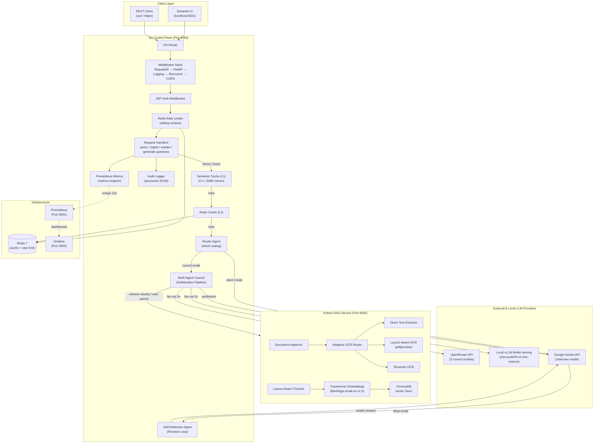
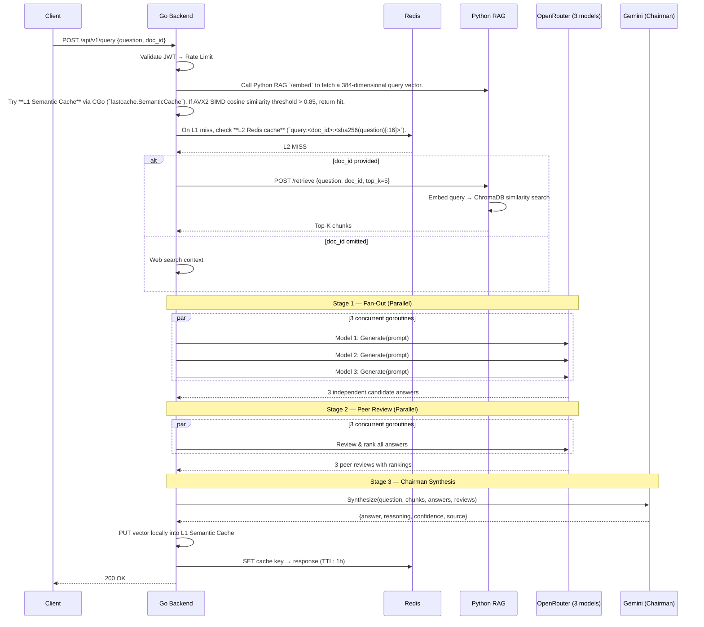

# CouncilAI: System Design Document

**Last Updated:** May 2026

---

## 1. Context & Scope

**CouncilAI** (originally "PadhAI Dost" — "Study Friend" in Hindi) is a multi-agent document deliberation and Q&A engine that replaces single-model inference with an ensemble **council-of-agents** pattern.

Instead of trusting a single Large Language Model (LLM), CouncilAI coordinates a multi-agent workflow: a **Router Agent** classifies queries, parallel **Council Member Agents** propose responses, a **Peer-Review Loop** cross-evaluates candidates, a **Chairman Agent** synthesizes the consensus, and a **Self-Reflection Agent** audits the results for quality and faithfulness. This produces answers with higher accuracy, built-in confidence scoring, and verifiable reasoning chains.

### User Journeys (In Scope)
* **Document Q&A**: Upload a PDF → ask questions → get council-synthesized answers grounded in the document.
* **General Q&A**: Ask questions without a document → get answers grounded with real-time Web Search.
* **Document Explanation**: Get adaptive explanations (beginner/intermediate/advanced depth).
* **Assessment Generation**: Generate MCQ or subjective questions from document content.

---

## 2. Goals & Non-Goals

### Goals
1. **Higher accuracy and fidelity** via multi-model consensus (vs. single LLM).
2. **Confidence scoring** — every answer must carry a numeric confidence rating.
3. **Cost optimization and High Throughput** — aggressively utilize C++ SIMD Semantic caching and Redis to bypass expensive LLM calls.
4. **Extensibility** — new LLMs, OCR backends, or features must plug in without core changes.
5. **Local First** — full support for offline local vLLM models without API fees.

### Non-Goals
* **Long-Term Multi-Turn Chat Memory**: Persistent, searchable chat history across years is out of scope for the current design phase (stateless sessions are used).
* **Role-Based Access Control (RBAC)**: Fine-grained permissions (Admin vs Editor) are not needed for this personal project.
* **Multi-Modal Output Generation**: Generating charts or images in the final answer is not in scope.

---

## 3. High-Level Design

### 3.1 Architecture Overview

### 3.2 Service Boundaries

| Service | Language | Port | Responsibility |
|---------|----------|------|----------------|
| **Go Backend** | Go 1.22 | 8080 | API gateway, auth, caching, LLM orchestration, metrics |
| **Python RAG** | Python 3.11 | 8000 | Document processing, OCR, chunking, embedding, retrieval |
| **Redis** | — | 6379 | Cache (1h TTL) + per-user rate limiting |
| **Prometheus** | — | 9091 | Metrics collection |
| **Grafana** | — | 3000 | Pre-built dashboards |

---

## 4. Detailed Design

### 4.1 Data Flow: Core Query (Cache Miss)

### 4.2 Scalability & Reliability

*   **Go Backend Scaling:** The Go control plane is entirely stateless (auth is JWT-based, cache is in Redis/L1). It can be horizontally scaled behind an Nginx load balancer.
*   **Progressive Degradation:** The orchestrator handles LLM failures dynamically. If 2 out of 3 models fail, it skips peer review. If peer reviews fail, it picks the longest candidate. If Chairman fails, it falls back to the highest peer-reviewed answer.
*   **Security:** Rate limiting via Redis sliding windows protects against abuse. JWT handles stateless auth. All queries are audit logged to structured JSON.

---

## 5. Alternatives Considered

*   **Single Monolithic Python Service vs. Multi-Service:** We considered writing the entire stack in FastAPI (Python). 
    * *Decision:* Rejected. Go provides vastly superior concurrent HTTP handling and goroutine orchestration necessary for the parallel fan-out loops of the multi-agent council. We accepted the ~5ms network overhead between Go and Python to use the best tool for each job (Go for orchestration, Python for ML/RAG).
*   **LangChain Default Splitters vs. Custom Layout-Aware Chunking:** We considered `RecursiveCharacterTextSplitter`. 
    * *Decision:* Rejected. It arbitrarily splits tables and captions, destroying context. We built a custom chunker that preserves semantic structure (tables remain whole, headings attach to body).

---

## 6. Architectural Decision Registry (ADR)

#### Decision 1: CGo + C++ SIMD L1 Cache vs. Pure Go / Redis Cache
* **Context**: To maximize request efficiency, we need a high-performance vector similarity L1 cache. Go's garbage collector (GC) introduces unpredictable pause times under massive in-memory dictionary states.
* **Logic**: Implementing the similarity index in C++ using Intel AVX2 SIMD instructions bypasses the Go GC entirely. Math registers evaluate 8 float products concurrently, giving **~240x latency speedups**.
* **Trade-offs**: Harder build pipeline. *Note: We added `#if defined(__AVX2__)` fallback for ARM64 portability [RESOLVED]*.

#### Decision 2: Zero-Fee Local Web Search (DDG + BeautifulSoup) vs. Headless Browser
* **Context**: Ground queries locally without API costs.
* **Logic**: Playwright runs complete Chromium engines (>500MB bloat). Utilizing `duckduckgo-search` + `beautifulsoup4` retrieves context in milliseconds with near-zero image footprint.
* **Trade-offs**: Susceptible to DDG layout changes or Cloudflare bot protections.

#### Gap 1: In-Memory User Ephemerality
* **Description**: User accounts are stored in-memory in `auth.go`. A server restart wipes the map, forcing users to sign up again.
* **Solution**: (Planned) Refactor to SQLite/Redis Hash persistence.

#### Gap 2: Google AVX2 SIMD Lock-in on Apple Silicon / ARM64 [RESOLVED]
* **Description**: The AVX2 intrinsics block compilation on Apple Silicon Macs and ARM64.
* **Solution**: Added preprocessor macro guards (`#if defined(__AVX2__)`) in `semantic_cache.cpp` to automatically fall back to standard C++ loops.

#### Gap 3: Path Traversal Vulnerabilities in Document Ingestion [RESOLVED]
* **Description**: Python RAG `/ingest` route handles raw filenames directly when generating `doc_id`.
* **Solution**: Added rigorous regex scrubbers inside `ingest.py` before building `doc_id`.

#### Gap 4: Missing Generated `doc_id` in Go Audit Logging [RESOLVED]
* **Description**: Go backend logged an empty string in `h.Audit.LogIngest`.
* **Solution**: Unmarshaled the `/ingest` response in `ingest.go` to capture the generated `doc_id`.

#### Gap 5: FIFO Eviction vs. True LRU Caching [RESOLVED]
* **Description**: `SemanticCache` behaved conceptually as a FIFO cache.
* **Solution**: Upgraded `Get` lock scopes to `std::unique_lock` on hits to safely promote accessed keys to the front of `lru_list_`.
